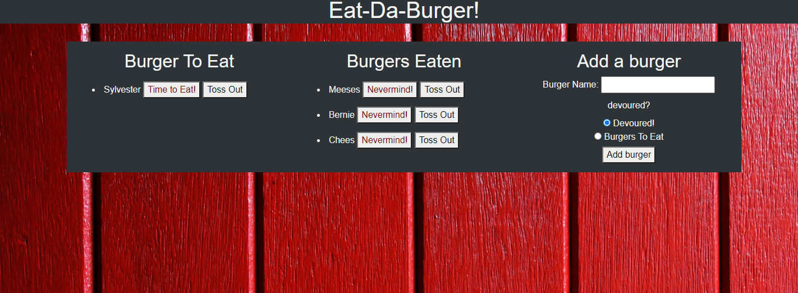
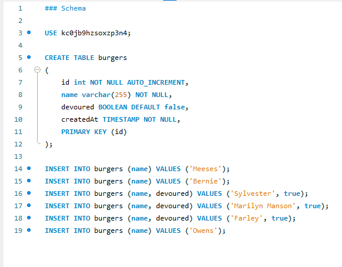
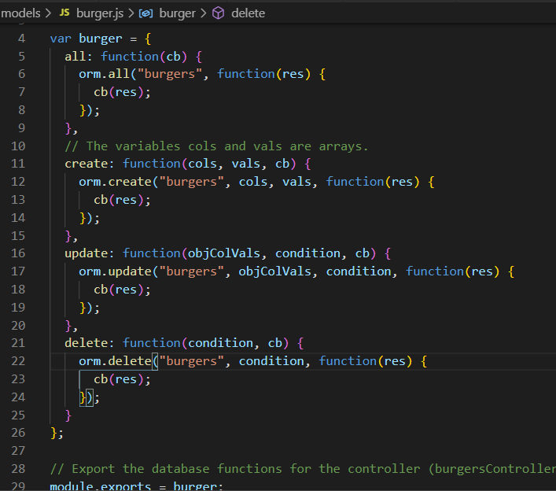

# Node Express Handlebars

###  A restaurant app that lets users input the names of burgers they'd like to eat.

## Table of Contents
* [Technologies Used](#Technologies_Used)
* [Deployed Site](#Deployed)
* [Features](#Features)
* [Usage](#Usage)
* [Author](#Author)
* [Credits](#Credits)
* [License](#License)

## Technologies_Used
* JavaScript 
* HTML
* CSS
* handlebars
* express.js
* [node.js](https://www.npmjs.com/)
* [mysql](https://www.mysqltutorial.org/)
* [heroku](https://dashboard.heroku.com/apps)
* JAWSDB (An addon for heroku)

<!-- ## Getting_Started

Once you have downloaded all the files (or done a git pull) from my repo there are a few steps you need to follow to set it up properly:
* Ppen up the code in mysql and visual studio code, make sure to save your msql code as the correct database name and password
* Run the database and make sure it is all set up with the seeded code
* In visual studio code, in a fresh integrated terminal (opened by right clicking the server.js and selecting it in the drop down) first run npm install and hit enter
* Once install is done, type in node server.js followed by enter to begin

To move throughout the menues use the arrow keys on your terminal and be sure to hit enter after you make your selection. If you run into trouble, or a completed action does not seem to have an end point and bring you back to the main set of questions - please select cltr (cmnd) + c and then re enter node server.js in the terminal, your action likely was not saved and you put something in that didn't work. -->

## Deployed Site
[Node Express Handlebars](https://lit-garden-17610.herokuapp.com/)

## Features 

### __1. A mysql database__

In order to store and read files using a database manager I had to integrate mysql code into my javascript.  I also needed to build an actual database to handle the data I was passing through (because json files aren't always so efficient.) Storing things in a database makes the data easier to manage, read and update. And is a great way to manage a lot of data

### __2. The ability to move burgers__

The main point of this project is to use the Model View Control method in order to better update and manage data through a web application, in other words a fully functional website! Being able to alter the mysql (or any database) is essential to this process. It all starts with the database, which interacts with the model, which interacts with the controller, which uses the routes to display or view the behaviors. So it's hard to show snippets of code without showing the entire code because variables/objects are being passed through many steps to make sure they are dynamic and controlled. 

Basically though, the burger needs to be updated in those 4 different places (database, model, controller and view) and passed through each step to get back and forth from the database. Doing it this way, assures us that everything is working, it provides quality data that displays accurately each and every time. 

### __3. The ability to add burgers__

This is a lot like updating burgers with only the slight addition that we need a separate input area to take in the burgers. This may seem like old hat for the stronger developers but, noting that there might needs to be a slightly different route I felt was necessary when we are talking about MVC. 

As you can see in the image above, the function is calling slightly different things. in the update we are calling an object of col vals but in create it's separated. These minor changes might seem small but these slight differences are important. 

### __4. A deployed site on heroku__

One of the biggest challenges faced in the project was deploying to heroku. Heroku was chosen because it supports server side as well as front end developed projects. Deploying heroku without mysql is a multi step process and takes some doing to get right. Deploying with mysql was even more complicated. So, in order to make sure I had the basic steps worked out well enough to deploy with mysql I created a list of instructions to share with my faculty and double check there wasn't anything I was doing wrong. 
[heroku-readme](https://github.com/RKSouth/heruku-guide)

It's not complete but it did help me get through the project and maybe, it will help with further work later.

### __5. Other__

 __For later builds__

_Change Hamburgers to Cookie and devoured to cooked_

I would use this app to help me keep track of what I had baked and if I had done it successfully

_Improve the CSS_

I think I got it pretty good, but I know it could be better for this assignment, especially if I wanted to use it regularly on my phone to track all the cookies/baked goods I have made.

  
## Usage
### This is meant for major food enthusiasts (who isn't) to help ensure they are getting a wide variety of their favorite dishes. Or it can simply act as a fun little game.

## Author 
Rachael Kelm-Southworth

* [linkedin](https://www.linkedin.com/in/rachael-kelm-southworth-87a3831b3) 

* [github](https://github.com/RKSouth/)

* [portfolio](https://rksouth.github.io/responsive_portfolio/)

 ## Credits

I would like to thank Kerwin, Manuel, Roger, Jerome and all my classmates for helping me understand this subject matter and anyone that contributed to make the base code.

## License
[MIT](https://choosealicense.com/licenses/mit/)

